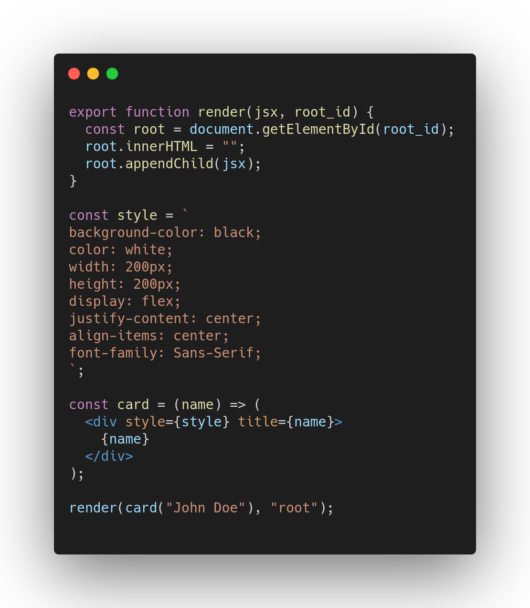

<p align='center'>
  
</p>

<p align='center' style='text-align: center;'>
  <h1>Fast Javascript Bundler</h1>
</p>


[https://fjbundler.com](https://fjbundler.com)

## What?
> It is what it says it is.  
> However, this bundler aims to be a monolithic does-it-all type of bundler;
> with zero configuration needed. _(however, optional configuration will be supported)_  

## Philosophy
1. A bundler should not need excessive attention.
2. A bundler should not get in the way of a developers workflow.
3. A bundler should be fast.
4. A bundler should not be written in Javascript / Node.
5. Commonly used features among JS developers should be supported out of the box.
6. The output of the bundler should work everywhere. (to an extent which is possible of course)

### More About the Philosophy
#### Output formats
> Most bundlers allows you to select an output format of the code, such as:
```
"CommonJS", "AMD", "System", "UMD", "ES6", "ES2015" or "ESNext"
```
> FJB does not implement this concept.  
> Instead, FJB adapts the code automatically through static analysis.  
> FJB aims to generate code that works everywhere (when possible).  
> A bundler should be smart enough so that the developer can focus on other things. :brain:

## How does one use it?
```bash
fjb index.js
```
## What if I want the output in a file?
```bash
fjb index.js > dist.js
```

### Features
- [x] Being fast
- [x] ES6 module imports / exports
- [x] Aliased imports
- [x] Wildcard imports
- [x] JSX support
- [x] TypeScript support (currently unstable and under development)
- [x] Importing JSON
- [x] Importing CSS
- [x] Importing & transpiling SCSS
- [x] Automatic JSX format detection
- [x] [Plugin support](PLUGINS.md)
- [x] Removing dead code (Tree shaking)
- [x] Supports package.json

### Planned Features
- [ ] Lazy imports

## Example
> Below is an example of some code that is **100%** supported.  
> (Without any plugins or configuration)


> For more examples, have a look at:
* [./examples](./examples)
* [./tests/src/test\_projects](./tests/src/test_projects)

## Benchmarks :rocket:
> To see benchmarks, have a look at [benchmarks.md](benchmarks.md) :fire:  
> You can also view them over at [https://fjbundler.com](https://fjbundler.com)

## Installing the easy way
### Using apt
> The easiest way to install FJB is to head over to [releases](https://github.com/sebbekarlsson/fjb/releases) and
> download a `.deb` file that suits you.  
> Then you can simply run:
```bash
sudo apt install ./<filename>.deb
```

## Installing the complicated way
### Dependencies
> To build `fjb` you will need the following:
1. A C compiler (I would suggest gcc)
2. Git

### Steps to Install :wrench:
#### Compiling it
1. Clone down the repository
2. Run:
```bash
./build.sh
```
> This step will generate a `fjb.out` executable file.  
> You can start using this right away. :tophat:

#### Installing globally
> To continue and install `fjb` globally:
Run:
```bash
make install
```
> Also make sure you add `$HOME/.local/bin`
> to your PATH.  
> [https://unix.stackexchange.com/questions/26047/how-to-correctly-add-a-path-to-path](https://unix.stackexchange.com/questions/26047/how-to-correctly-add-a-path-to-path)

## Questions and Answers :question:
### How fast is it?
> Have a look at [benchmarks.md](benchmarks.md) :fire:

### How serious is this?
> Not sure, it's just a hobby project at this point.

### Why are you making this?
> Frustration, frustration with existing tools.  
> The existing alternatives are not fast enough, and gets in the
> way a bit more than they should.

### Is it mature enough to use it with React?
> You can definitely bundle React apps with FJB.  
> However, there might be some missing features / bugs since the JSX
> implementation in FJB is pretty new.  
> You can see a working React example [here](tests/src/test_projects/with_react)

### Should I use it?
> I will not encourage anyone to use it, but feel free to do it.

### Does it work on Linux?
> Yes

### Does it work on Windows?
> Probably not, but feel free to make a pull-request with the required changes
> for it to work.

### Does it work on MacOS?
> Probably.
> I haven't tried it, but I would definitely think so.

### Can I contribute?
> Yes you can. Simply fork it and start making pull-requests.

### How do I create a plugin for it?
> Have a look at this [guide](PLUGINS.md)

### Will you add support for writing plugins in Javascript?
> No. I don't think Javascript belongs in a bundler.  
> The reason why most bundlers today are slow, is because they are written in Javascript.

### What if I find a bug?
> If you find a bug, please report it here: [https://github.com/sebbekarlsson/fjb/issues](https://github.com/sebbekarlsson/fjb/issues)

### Does it support Typescript?
> Yes, but this feature is under development... so expect bugs.

### What license is FJB under?
> GPL-3.0, [LICENSE.md](LICENSE.md)

### I'm having problems installing FJB
> Feel free to create an issue here, and I'll be able to help you.

### Can I become a collaborator?
> I would prefer if you make pull-requests through forking at first.  
> Once I've seen that you've made valuable contributions, you might be able to
> be added as a collaborator.
