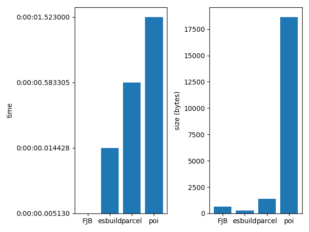

# Benchmarks
> These benchmarks were generated at **2021-02-14 15:33:23.024438**


<details>
  <summary>Ternary operator</summary>

## What's being executed
> Code executed:
```tsx
function getNumber(x)
{
  switch (x) {
    case "hello": return 1; break;
    case "world": return 2; break;
    default: return 0; break;
  }
}


const y = 4;

const x = y > 3 ? y : z;

const g = x > 0 ? { name: "john" } : { name: "sarah" };

```


  
<details>
  <summary>FJB - time: 0:00:00.003466, output size: 299 bytes</summary>

#### Output size
> The size of the output is:
```
299 bytes
```
#### Time
> The command:
```
/home/ianertson/workspace/fjb/fjb.out /home/ianertson/workspace/fjb/tests/src/test_projects/ternary/index.js  > ./dist.js
````
> finished in:
```
0:00:00.003466
```
</details>


  
<details>
  <summary>esbuild - time: 0:00:00.003893, output size: 151 bytes</summary>

#### Output size
> The size of the output is:
```
151 bytes
```
#### Time
> The command:
```
/home/ianertson/workspace/fjb/benchmark/node_modules/.bin/esbuild /home/ianertson/workspace/fjb/tests/src/test_projects/ternary/index.js  --bundle --outfile=./dist.js
````
> finished in:
```
0:00:00.003893
```
</details>


  
<details>
  <summary>parcel - time: 0:00:00.543266, output size: 1265 bytes</summary>

#### Output size
> The size of the output is:
```
1265 bytes
```
#### Time
> The command:
```
/home/ianertson/workspace/fjb/benchmark/node_modules/.bin/parcel build /home/ianertson/workspace/fjb/tests/src/test_projects/ternary/index.js 
````
> finished in:
```
0:00:00.543266
```
</details>


  
<details>
  <summary>poi - time: 0:00:01.488210, output size: 4670 bytes</summary>

#### Output size
> The size of the output is:
```
4670 bytes
```
#### Time
> The command:
```
/home/ianertson/workspace/fjb/benchmark/node_modules/.bin/poi /home/ianertson/workspace/fjb/tests/src/test_projects/ternary/index.js 
````
> finished in:
```
0:00:01.488210
```
</details>


#### Executed on
```
Architecture:                    x86_64
CPU op-mode(s):                  32-bit, 64-bit
Byte Order:                      Little Endian
Address sizes:                   39 bits physical, 48 bits virtual
CPU(s):                          16
On-line CPU(s) list:             0-15
Thread(s) per core:              2
Core(s) per socket:              8
Socket(s):                       1
NUMA node(s):                    1
Vendor ID:                       GenuineIntel
CPU family:                      6
Model:                           158
Model name:                      Intel(R) Core(TM) i9-9980HK CPU @ 2.40GHz
Stepping:                        13
CPU MHz:                         4130.252
CPU max MHz:                     5000.0000
CPU min MHz:                     800.0000
BogoMIPS:                        4800.00
Virtualization:                  VT-x
L1d cache:                       256 KiB
L1i cache:                       256 KiB
L2 cache:                        2 MiB
L3 cache:                        16 MiB
NUMA node0 CPU(s):               0-15
Vulnerability Itlb multihit:     KVM: Mitigation: VMX disabled
Vulnerability L1tf:              Not affected
Vulnerability Mds:               Not affected
Vulnerability Meltdown:          Not affected
Vulnerability Spec store bypass: Mitigation; Speculative Store Bypass disabled via prctl and seccomp
Vulnerability Spectre v1:        Mitigation; usercopy/swapgs barriers and __user pointer sanitization
Vulnerability Spectre v2:        Mitigation; Enhanced IBRS, IBPB conditional, RSB filling
Vulnerability Srbds:             Mitigation; TSX disabled
Vulnerability Tsx async abort:   Mitigation; TSX disabled
Flags:                           fpu vme de pse tsc msr pae mce cx8 apic sep mtrr pge mca cmov pat pse36 clflush dts acpi mmx fxsr sse sse2 ss ht tm pbe syscall nx pdpe1gb rdtscp lm constant_tsc art arch_perfmon pebs bts rep_good nopl xtopology nonstop_tsc cpuid aperfmperf pni pclmulqdq dtes64 monitor ds_cpl vmx est tm2 ssse3 sdbg fma cx16 xtpr pdcm pcid sse4_1 sse4_2 x2apic movbe popcnt tsc_deadline_timer aes xsave avx f16c rdrand lahf_lm abm 3dnowprefetch cpuid_fault epb invpcid_single ssbd ibrs ibpb stibp ibrs_enhanced tpr_shadow vnmi flexpriority ept vpid ept_ad fsgsbase tsc_adjust bmi1 avx2 smep bmi2 erms invpcid mpx rdseed adx smap clflushopt intel_pt xsaveopt xsavec xgetbv1 xsaves dtherm ida arat pln pts hwp hwp_notify hwp_act_window hwp_epp md_clear flush_l1d arch_capabilities

```
</details>

<details>
  <summary>Destruct</summary>

## What's being executed
> Code executed:
```tsx
function xyz({
  firstname = "john",
  lastname
}) {
  console.log(firstname, lastname);
}

xyz("john", "doe");

```


  
<details>
  <summary>FJB - time: 0:00:00.003194, output size: 207 bytes</summary>

#### Output size
> The size of the output is:
```
207 bytes
```
#### Time
> The command:
```
/home/ianertson/workspace/fjb/fjb.out /home/ianertson/workspace/fjb/tests/src/test_projects/destruct/index.js  > ./dist.js
````
> finished in:
```
0:00:00.003194
```
</details>


  
<details>
  <summary>esbuild - time: 0:00:00.004202, output size: 187 bytes</summary>

#### Output size
> The size of the output is:
```
187 bytes
```
#### Time
> The command:
```
/home/ianertson/workspace/fjb/benchmark/node_modules/.bin/esbuild /home/ianertson/workspace/fjb/tests/src/test_projects/destruct/index.js  --bundle --outfile=./dist.js
````
> finished in:
```
0:00:00.004202
```
</details>


  
<details>
  <summary>parcel - time: 0:00:00.490450, output size: 1228 bytes</summary>

#### Output size
> The size of the output is:
```
1228 bytes
```
#### Time
> The command:
```
/home/ianertson/workspace/fjb/benchmark/node_modules/.bin/parcel build /home/ianertson/workspace/fjb/tests/src/test_projects/destruct/index.js 
````
> finished in:
```
0:00:00.490450
```
</details>


  
<details>
  <summary>poi - time: 0:00:01.485439, output size: 4625 bytes</summary>

#### Output size
> The size of the output is:
```
4625 bytes
```
#### Time
> The command:
```
/home/ianertson/workspace/fjb/benchmark/node_modules/.bin/poi /home/ianertson/workspace/fjb/tests/src/test_projects/destruct/index.js 
````
> finished in:
```
0:00:01.485439
```
</details>


#### Executed on
```
Architecture:                    x86_64
CPU op-mode(s):                  32-bit, 64-bit
Byte Order:                      Little Endian
Address sizes:                   39 bits physical, 48 bits virtual
CPU(s):                          16
On-line CPU(s) list:             0-15
Thread(s) per core:              2
Core(s) per socket:              8
Socket(s):                       1
NUMA node(s):                    1
Vendor ID:                       GenuineIntel
CPU family:                      6
Model:                           158
Model name:                      Intel(R) Core(TM) i9-9980HK CPU @ 2.40GHz
Stepping:                        13
CPU MHz:                         3710.486
CPU max MHz:                     5000.0000
CPU min MHz:                     800.0000
BogoMIPS:                        4800.00
Virtualization:                  VT-x
L1d cache:                       256 KiB
L1i cache:                       256 KiB
L2 cache:                        2 MiB
L3 cache:                        16 MiB
NUMA node0 CPU(s):               0-15
Vulnerability Itlb multihit:     KVM: Mitigation: VMX disabled
Vulnerability L1tf:              Not affected
Vulnerability Mds:               Not affected
Vulnerability Meltdown:          Not affected
Vulnerability Spec store bypass: Mitigation; Speculative Store Bypass disabled via prctl and seccomp
Vulnerability Spectre v1:        Mitigation; usercopy/swapgs barriers and __user pointer sanitization
Vulnerability Spectre v2:        Mitigation; Enhanced IBRS, IBPB conditional, RSB filling
Vulnerability Srbds:             Mitigation; TSX disabled
Vulnerability Tsx async abort:   Mitigation; TSX disabled
Flags:                           fpu vme de pse tsc msr pae mce cx8 apic sep mtrr pge mca cmov pat pse36 clflush dts acpi mmx fxsr sse sse2 ss ht tm pbe syscall nx pdpe1gb rdtscp lm constant_tsc art arch_perfmon pebs bts rep_good nopl xtopology nonstop_tsc cpuid aperfmperf pni pclmulqdq dtes64 monitor ds_cpl vmx est tm2 ssse3 sdbg fma cx16 xtpr pdcm pcid sse4_1 sse4_2 x2apic movbe popcnt tsc_deadline_timer aes xsave avx f16c rdrand lahf_lm abm 3dnowprefetch cpuid_fault epb invpcid_single ssbd ibrs ibpb stibp ibrs_enhanced tpr_shadow vnmi flexpriority ept vpid ept_ad fsgsbase tsc_adjust bmi1 avx2 smep bmi2 erms invpcid mpx rdseed adx smap clflushopt intel_pt xsaveopt xsavec xgetbv1 xsaves dtherm ida arat pln pts hwp hwp_notify hwp_act_window hwp_epp md_clear flush_l1d arch_capabilities

```
</details>

<details>
  <summary>Importing ES6 modules</summary>

## What's being executed
> Code executed:
```tsx
import { subtract } from './helpers/math';


const x = 10;
const y = 5;
const r = subtract(x, y);
console.log(r);

```


  
<details>
  <summary>FJB - time: 0:00:00.004322, output size: 381 bytes</summary>

#### Output size
> The size of the output is:
```
381 bytes
```
#### Time
> The command:
```
/home/ianertson/workspace/fjb/fjb.out /home/ianertson/workspace/fjb/tests/src/test_projects/es6/index.js  > ./dist.js
````
> finished in:
```
0:00:00.004322
```
</details>


  
<details>
  <summary>esbuild - time: 0:00:00.005804, output size: 232 bytes</summary>

#### Output size
> The size of the output is:
```
232 bytes
```
#### Time
> The command:
```
/home/ianertson/workspace/fjb/benchmark/node_modules/.bin/esbuild /home/ianertson/workspace/fjb/tests/src/test_projects/es6/index.js  --bundle --outfile=./dist.js
````
> finished in:
```
0:00:00.005804
```
</details>


  
<details>
  <summary>parcel - time: 0:00:00.494444, output size: 1488 bytes</summary>

#### Output size
> The size of the output is:
```
1488 bytes
```
#### Time
> The command:
```
/home/ianertson/workspace/fjb/benchmark/node_modules/.bin/parcel build /home/ianertson/workspace/fjb/tests/src/test_projects/es6/index.js 
````
> finished in:
```
0:00:00.494444
```
</details>


  
<details>
  <summary>poi - time: 0:00:01.487864, output size: 5601 bytes</summary>

#### Output size
> The size of the output is:
```
5601 bytes
```
#### Time
> The command:
```
/home/ianertson/workspace/fjb/benchmark/node_modules/.bin/poi /home/ianertson/workspace/fjb/tests/src/test_projects/es6/index.js 
````
> finished in:
```
0:00:01.487864
```
</details>


#### Executed on
```
Architecture:                    x86_64
CPU op-mode(s):                  32-bit, 64-bit
Byte Order:                      Little Endian
Address sizes:                   39 bits physical, 48 bits virtual
CPU(s):                          16
On-line CPU(s) list:             0-15
Thread(s) per core:              2
Core(s) per socket:              8
Socket(s):                       1
NUMA node(s):                    1
Vendor ID:                       GenuineIntel
CPU family:                      6
Model:                           158
Model name:                      Intel(R) Core(TM) i9-9980HK CPU @ 2.40GHz
Stepping:                        13
CPU MHz:                         3616.508
CPU max MHz:                     5000.0000
CPU min MHz:                     800.0000
BogoMIPS:                        4800.00
Virtualization:                  VT-x
L1d cache:                       256 KiB
L1i cache:                       256 KiB
L2 cache:                        2 MiB
L3 cache:                        16 MiB
NUMA node0 CPU(s):               0-15
Vulnerability Itlb multihit:     KVM: Mitigation: VMX disabled
Vulnerability L1tf:              Not affected
Vulnerability Mds:               Not affected
Vulnerability Meltdown:          Not affected
Vulnerability Spec store bypass: Mitigation; Speculative Store Bypass disabled via prctl and seccomp
Vulnerability Spectre v1:        Mitigation; usercopy/swapgs barriers and __user pointer sanitization
Vulnerability Spectre v2:        Mitigation; Enhanced IBRS, IBPB conditional, RSB filling
Vulnerability Srbds:             Mitigation; TSX disabled
Vulnerability Tsx async abort:   Mitigation; TSX disabled
Flags:                           fpu vme de pse tsc msr pae mce cx8 apic sep mtrr pge mca cmov pat pse36 clflush dts acpi mmx fxsr sse sse2 ss ht tm pbe syscall nx pdpe1gb rdtscp lm constant_tsc art arch_perfmon pebs bts rep_good nopl xtopology nonstop_tsc cpuid aperfmperf pni pclmulqdq dtes64 monitor ds_cpl vmx est tm2 ssse3 sdbg fma cx16 xtpr pdcm pcid sse4_1 sse4_2 x2apic movbe popcnt tsc_deadline_timer aes xsave avx f16c rdrand lahf_lm abm 3dnowprefetch cpuid_fault epb invpcid_single ssbd ibrs ibpb stibp ibrs_enhanced tpr_shadow vnmi flexpriority ept vpid ept_ad fsgsbase tsc_adjust bmi1 avx2 smep bmi2 erms invpcid mpx rdseed adx smap clflushopt intel_pt xsaveopt xsavec xgetbv1 xsaves dtherm ida arat pln pts hwp hwp_notify hwp_act_window hwp_epp md_clear flush_l1d arch_capabilities

```
</details>

<details>
  <summary>Importing aliased ES6 modules</summary>

## What's being executed
> Code executed:
```tsx
import { multiply as mul } from './utils';


const r = mul(5, 5);

console.log(r);

```


  
<details>
  <summary>FJB - time: 0:00:00.003602, output size: 340 bytes</summary>

#### Output size
> The size of the output is:
```
340 bytes
```
#### Time
> The command:
```
/home/ianertson/workspace/fjb/fjb.out /home/ianertson/workspace/fjb/tests/src/test_projects/alias_imports/index.js  > ./dist.js
````
> finished in:
```
0:00:00.003602
```
</details>


  
<details>
  <summary>esbuild - time: 0:00:00.005986, output size: 214 bytes</summary>

#### Output size
> The size of the output is:
```
214 bytes
```
#### Time
> The command:
```
/home/ianertson/workspace/fjb/benchmark/node_modules/.bin/esbuild /home/ianertson/workspace/fjb/tests/src/test_projects/alias_imports/index.js  --bundle --outfile=./dist.js
````
> finished in:
```
0:00:00.005986
```
</details>


  
<details>
  <summary>parcel - time: 0:00:00.480347, output size: 1383 bytes</summary>

#### Output size
> The size of the output is:
```
1383 bytes
```
#### Time
> The command:
```
/home/ianertson/workspace/fjb/benchmark/node_modules/.bin/parcel build /home/ianertson/workspace/fjb/tests/src/test_projects/alias_imports/index.js 
````
> finished in:
```
0:00:00.480347
```
</details>


  
<details>
  <summary>poi - time: 0:00:01.490825, output size: 5354 bytes</summary>

#### Output size
> The size of the output is:
```
5354 bytes
```
#### Time
> The command:
```
/home/ianertson/workspace/fjb/benchmark/node_modules/.bin/poi /home/ianertson/workspace/fjb/tests/src/test_projects/alias_imports/index.js 
````
> finished in:
```
0:00:01.490825
```
</details>


#### Executed on
```
Architecture:                    x86_64
CPU op-mode(s):                  32-bit, 64-bit
Byte Order:                      Little Endian
Address sizes:                   39 bits physical, 48 bits virtual
CPU(s):                          16
On-line CPU(s) list:             0-15
Thread(s) per core:              2
Core(s) per socket:              8
Socket(s):                       1
NUMA node(s):                    1
Vendor ID:                       GenuineIntel
CPU family:                      6
Model:                           158
Model name:                      Intel(R) Core(TM) i9-9980HK CPU @ 2.40GHz
Stepping:                        13
CPU MHz:                         4055.628
CPU max MHz:                     5000.0000
CPU min MHz:                     800.0000
BogoMIPS:                        4800.00
Virtualization:                  VT-x
L1d cache:                       256 KiB
L1i cache:                       256 KiB
L2 cache:                        2 MiB
L3 cache:                        16 MiB
NUMA node0 CPU(s):               0-15
Vulnerability Itlb multihit:     KVM: Mitigation: VMX disabled
Vulnerability L1tf:              Not affected
Vulnerability Mds:               Not affected
Vulnerability Meltdown:          Not affected
Vulnerability Spec store bypass: Mitigation; Speculative Store Bypass disabled via prctl and seccomp
Vulnerability Spectre v1:        Mitigation; usercopy/swapgs barriers and __user pointer sanitization
Vulnerability Spectre v2:        Mitigation; Enhanced IBRS, IBPB conditional, RSB filling
Vulnerability Srbds:             Mitigation; TSX disabled
Vulnerability Tsx async abort:   Mitigation; TSX disabled
Flags:                           fpu vme de pse tsc msr pae mce cx8 apic sep mtrr pge mca cmov pat pse36 clflush dts acpi mmx fxsr sse sse2 ss ht tm pbe syscall nx pdpe1gb rdtscp lm constant_tsc art arch_perfmon pebs bts rep_good nopl xtopology nonstop_tsc cpuid aperfmperf pni pclmulqdq dtes64 monitor ds_cpl vmx est tm2 ssse3 sdbg fma cx16 xtpr pdcm pcid sse4_1 sse4_2 x2apic movbe popcnt tsc_deadline_timer aes xsave avx f16c rdrand lahf_lm abm 3dnowprefetch cpuid_fault epb invpcid_single ssbd ibrs ibpb stibp ibrs_enhanced tpr_shadow vnmi flexpriority ept vpid ept_ad fsgsbase tsc_adjust bmi1 avx2 smep bmi2 erms invpcid mpx rdseed adx smap clflushopt intel_pt xsaveopt xsavec xgetbv1 xsaves dtherm ida arat pln pts hwp hwp_notify hwp_act_window hwp_epp md_clear flush_l1d arch_capabilities

```
</details>

<details>
  <summary>Importing CSS</summary>

## What's being executed
> Code executed:
```tsx
import style from './style.css';


const cssEl = document.createElement('style')
cssEl.innerText = style;
document.head.appendChild(cssEl);

```



  
<details>
  <summary>FJB - time: 0:00:00.002446, output size: 644 bytes</summary>

#### Output size
> The size of the output is:
```
644 bytes
```
#### Time
> The command:
```
/home/ianertson/workspace/fjb/fjb.out /home/ianertson/workspace/fjb/tests/src/test_projects/css_import/index.js  > ./dist.js
````
> finished in:
```
0:00:00.002446
```
</details>


  
<details>
  <summary>esbuild - time: 0:00:00.003300, output size: 249 bytes</summary>

#### Output size
> The size of the output is:
```
249 bytes
```
#### Time
> The command:
```
/home/ianertson/workspace/fjb/benchmark/node_modules/.bin/esbuild /home/ianertson/workspace/fjb/tests/src/test_projects/css_import/index.js  --bundle --outfile=./dist.js
````
> finished in:
```
0:00:00.003300
```
</details>


  
<details>
  <summary>parcel - time: 0:00:00.515235, output size: 1383 bytes</summary>

#### Output size
> The size of the output is:
```
1383 bytes
```
#### Time
> The command:
```
/home/ianertson/workspace/fjb/benchmark/node_modules/.bin/parcel build /home/ianertson/workspace/fjb/tests/src/test_projects/css_import/index.js 
````
> finished in:
```
0:00:00.515235
```
</details>


  
<details>
  <summary>poi - time: 0:00:01.488607, output size: 18660 bytes</summary>

#### Output size
> The size of the output is:
```
18660 bytes
```
#### Time
> The command:
```
/home/ianertson/workspace/fjb/benchmark/node_modules/.bin/poi /home/ianertson/workspace/fjb/tests/src/test_projects/css_import/index.js 
````
> finished in:
```
0:00:01.488607
```
</details>


#### Executed on
```
Architecture:                    x86_64
CPU op-mode(s):                  32-bit, 64-bit
Byte Order:                      Little Endian
Address sizes:                   39 bits physical, 48 bits virtual
CPU(s):                          16
On-line CPU(s) list:             0-15
Thread(s) per core:              2
Core(s) per socket:              8
Socket(s):                       1
NUMA node(s):                    1
Vendor ID:                       GenuineIntel
CPU family:                      6
Model:                           158
Model name:                      Intel(R) Core(TM) i9-9980HK CPU @ 2.40GHz
Stepping:                        13
CPU MHz:                         3482.261
CPU max MHz:                     5000.0000
CPU min MHz:                     800.0000
BogoMIPS:                        4800.00
Virtualization:                  VT-x
L1d cache:                       256 KiB
L1i cache:                       256 KiB
L2 cache:                        2 MiB
L3 cache:                        16 MiB
NUMA node0 CPU(s):               0-15
Vulnerability Itlb multihit:     KVM: Mitigation: VMX disabled
Vulnerability L1tf:              Not affected
Vulnerability Mds:               Not affected
Vulnerability Meltdown:          Not affected
Vulnerability Spec store bypass: Mitigation; Speculative Store Bypass disabled via prctl and seccomp
Vulnerability Spectre v1:        Mitigation; usercopy/swapgs barriers and __user pointer sanitization
Vulnerability Spectre v2:        Mitigation; Enhanced IBRS, IBPB conditional, RSB filling
Vulnerability Srbds:             Mitigation; TSX disabled
Vulnerability Tsx async abort:   Mitigation; TSX disabled
Flags:                           fpu vme de pse tsc msr pae mce cx8 apic sep mtrr pge mca cmov pat pse36 clflush dts acpi mmx fxsr sse sse2 ss ht tm pbe syscall nx pdpe1gb rdtscp lm constant_tsc art arch_perfmon pebs bts rep_good nopl xtopology nonstop_tsc cpuid aperfmperf pni pclmulqdq dtes64 monitor ds_cpl vmx est tm2 ssse3 sdbg fma cx16 xtpr pdcm pcid sse4_1 sse4_2 x2apic movbe popcnt tsc_deadline_timer aes xsave avx f16c rdrand lahf_lm abm 3dnowprefetch cpuid_fault epb invpcid_single ssbd ibrs ibpb stibp ibrs_enhanced tpr_shadow vnmi flexpriority ept vpid ept_ad fsgsbase tsc_adjust bmi1 avx2 smep bmi2 erms invpcid mpx rdseed adx smap clflushopt intel_pt xsaveopt xsavec xgetbv1 xsaves dtherm ida arat pln pts hwp hwp_notify hwp_act_window hwp_epp md_clear flush_l1d arch_capabilities

```
</details>

<details>
  <summary>Importing JSON</summary>

## What's being executed
> Code executed:
```tsx
import people from './people.json';

console.log(people[0].first_name);

```


  
<details>
  <summary>FJB - time: 0:00:00.002989, output size: 1358 bytes</summary>

#### Output size
> The size of the output is:
```
1358 bytes
```
#### Time
> The command:
```
/home/ianertson/workspace/fjb/fjb.out /home/ianertson/workspace/fjb/tests/src/test_projects/json_import/index.js  > ./dist.js
````
> finished in:
```
0:00:00.002989
```
</details>


  
<details>
  <summary>esbuild - time: 0:00:00.005319, output size: 1003 bytes</summary>

#### Output size
> The size of the output is:
```
1003 bytes
```
#### Time
> The command:
```
/home/ianertson/workspace/fjb/benchmark/node_modules/.bin/esbuild /home/ianertson/workspace/fjb/tests/src/test_projects/json_import/index.js  --bundle --outfile=./dist.js
````
> finished in:
```
0:00:00.005319
```
</details>


  
<details>
  <summary>parcel - time: 0:00:00.521632, output size: 1822 bytes</summary>

#### Output size
> The size of the output is:
```
1822 bytes
```
#### Time
> The command:
```
/home/ianertson/workspace/fjb/benchmark/node_modules/.bin/parcel build /home/ianertson/workspace/fjb/tests/src/test_projects/json_import/index.js 
````
> finished in:
```
0:00:00.521632
```
</details>


  
<details>
  <summary>poi - time: 0:00:01.556032, output size: 5936 bytes</summary>

#### Output size
> The size of the output is:
```
5936 bytes
```
#### Time
> The command:
```
/home/ianertson/workspace/fjb/benchmark/node_modules/.bin/poi /home/ianertson/workspace/fjb/tests/src/test_projects/json_import/index.js 
````
> finished in:
```
0:00:01.556032
```
</details>


#### Executed on
```
Architecture:                    x86_64
CPU op-mode(s):                  32-bit, 64-bit
Byte Order:                      Little Endian
Address sizes:                   39 bits physical, 48 bits virtual
CPU(s):                          16
On-line CPU(s) list:             0-15
Thread(s) per core:              2
Core(s) per socket:              8
Socket(s):                       1
NUMA node(s):                    1
Vendor ID:                       GenuineIntel
CPU family:                      6
Model:                           158
Model name:                      Intel(R) Core(TM) i9-9980HK CPU @ 2.40GHz
Stepping:                        13
CPU MHz:                         900.068
CPU max MHz:                     5000.0000
CPU min MHz:                     800.0000
BogoMIPS:                        4800.00
Virtualization:                  VT-x
L1d cache:                       256 KiB
L1i cache:                       256 KiB
L2 cache:                        2 MiB
L3 cache:                        16 MiB
NUMA node0 CPU(s):               0-15
Vulnerability Itlb multihit:     KVM: Mitigation: VMX disabled
Vulnerability L1tf:              Not affected
Vulnerability Mds:               Not affected
Vulnerability Meltdown:          Not affected
Vulnerability Spec store bypass: Mitigation; Speculative Store Bypass disabled via prctl and seccomp
Vulnerability Spectre v1:        Mitigation; usercopy/swapgs barriers and __user pointer sanitization
Vulnerability Spectre v2:        Mitigation; Enhanced IBRS, IBPB conditional, RSB filling
Vulnerability Srbds:             Mitigation; TSX disabled
Vulnerability Tsx async abort:   Mitigation; TSX disabled
Flags:                           fpu vme de pse tsc msr pae mce cx8 apic sep mtrr pge mca cmov pat pse36 clflush dts acpi mmx fxsr sse sse2 ss ht tm pbe syscall nx pdpe1gb rdtscp lm constant_tsc art arch_perfmon pebs bts rep_good nopl xtopology nonstop_tsc cpuid aperfmperf pni pclmulqdq dtes64 monitor ds_cpl vmx est tm2 ssse3 sdbg fma cx16 xtpr pdcm pcid sse4_1 sse4_2 x2apic movbe popcnt tsc_deadline_timer aes xsave avx f16c rdrand lahf_lm abm 3dnowprefetch cpuid_fault epb invpcid_single ssbd ibrs ibpb stibp ibrs_enhanced tpr_shadow vnmi flexpriority ept vpid ept_ad fsgsbase tsc_adjust bmi1 avx2 smep bmi2 erms invpcid mpx rdseed adx smap clflushopt intel_pt xsaveopt xsavec xgetbv1 xsaves dtherm ida arat pln pts hwp hwp_notify hwp_act_window hwp_epp md_clear flush_l1d arch_capabilities

```
</details>

<details>
  <summary>Importing `ceil` from lodash, with tree shaking.</summary>

## What's being executed
> Code executed:
```tsx
import { ceil } from 'lodash';


console.log(ceil(25.443));

```


  
<details>
  <summary>esbuild - time: 0:00:00.018633, output size: 222632 bytes</summary>

#### Output size
> The size of the output is:
```
222632 bytes
```
#### Time
> The command:
```
/home/ianertson/workspace/fjb/benchmark/node_modules/.bin/esbuild /home/ianertson/workspace/fjb/tests/src/test_projects/with_lodash/index.js  --bundle --outfile=./dist.js
````
> finished in:
```
0:00:00.018633
```
</details>


  
<details>
  <summary>FJB - time: 0:00:00.488218, output size: 2258 bytes</summary>

#### Output size
> The size of the output is:
```
2258 bytes
```
#### Time
> The command:
```
/home/ianertson/workspace/fjb/fjb.out /home/ianertson/workspace/fjb/tests/src/test_projects/with_lodash/index.js  > ./dist.js
````
> finished in:
```
0:00:00.488218
```
</details>


  
<details>
  <summary>parcel - time: 0:00:00.558870, output size: 94714 bytes</summary>

#### Output size
> The size of the output is:
```
94714 bytes
```
#### Time
> The command:
```
/home/ianertson/workspace/fjb/benchmark/node_modules/.bin/parcel build /home/ianertson/workspace/fjb/tests/src/test_projects/with_lodash/index.js 
````
> finished in:
```
0:00:00.558870
```
</details>


  
<details>
  <summary>poi - time: 0:00:01.513932, output size: 549705 bytes</summary>

#### Output size
> The size of the output is:
```
549705 bytes
```
#### Time
> The command:
```
/home/ianertson/workspace/fjb/benchmark/node_modules/.bin/poi /home/ianertson/workspace/fjb/tests/src/test_projects/with_lodash/index.js 
````
> finished in:
```
0:00:01.513932
```
</details>


#### Executed on
```
Architecture:                    x86_64
CPU op-mode(s):                  32-bit, 64-bit
Byte Order:                      Little Endian
Address sizes:                   39 bits physical, 48 bits virtual
CPU(s):                          16
On-line CPU(s) list:             0-15
Thread(s) per core:              2
Core(s) per socket:              8
Socket(s):                       1
NUMA node(s):                    1
Vendor ID:                       GenuineIntel
CPU family:                      6
Model:                           158
Model name:                      Intel(R) Core(TM) i9-9980HK CPU @ 2.40GHz
Stepping:                        13
CPU MHz:                         1000.006
CPU max MHz:                     5000.0000
CPU min MHz:                     800.0000
BogoMIPS:                        4800.00
Virtualization:                  VT-x
L1d cache:                       256 KiB
L1i cache:                       256 KiB
L2 cache:                        2 MiB
L3 cache:                        16 MiB
NUMA node0 CPU(s):               0-15
Vulnerability Itlb multihit:     KVM: Mitigation: VMX disabled
Vulnerability L1tf:              Not affected
Vulnerability Mds:               Not affected
Vulnerability Meltdown:          Not affected
Vulnerability Spec store bypass: Mitigation; Speculative Store Bypass disabled via prctl and seccomp
Vulnerability Spectre v1:        Mitigation; usercopy/swapgs barriers and __user pointer sanitization
Vulnerability Spectre v2:        Mitigation; Enhanced IBRS, IBPB conditional, RSB filling
Vulnerability Srbds:             Mitigation; TSX disabled
Vulnerability Tsx async abort:   Mitigation; TSX disabled
Flags:                           fpu vme de pse tsc msr pae mce cx8 apic sep mtrr pge mca cmov pat pse36 clflush dts acpi mmx fxsr sse sse2 ss ht tm pbe syscall nx pdpe1gb rdtscp lm constant_tsc art arch_perfmon pebs bts rep_good nopl xtopology nonstop_tsc cpuid aperfmperf pni pclmulqdq dtes64 monitor ds_cpl vmx est tm2 ssse3 sdbg fma cx16 xtpr pdcm pcid sse4_1 sse4_2 x2apic movbe popcnt tsc_deadline_timer aes xsave avx f16c rdrand lahf_lm abm 3dnowprefetch cpuid_fault epb invpcid_single ssbd ibrs ibpb stibp ibrs_enhanced tpr_shadow vnmi flexpriority ept vpid ept_ad fsgsbase tsc_adjust bmi1 avx2 smep bmi2 erms invpcid mpx rdseed adx smap clflushopt intel_pt xsaveopt xsavec xgetbv1 xsaves dtherm ida arat pln pts hwp hwp_notify hwp_act_window hwp_epp md_clear flush_l1d arch_capabilities

```
</details>

<details>
  <summary>Require `jquery`</summary>

## What's being executed
> Code executed:
```tsx
const $ = require('./jquery');

console.log($);

```


  
<details>
  <summary>esbuild - time: 0:00:00.014303, output size: 149812 bytes</summary>

#### Output size
> The size of the output is:
```
149812 bytes
```
#### Time
> The command:
```
/home/ianertson/workspace/fjb/benchmark/node_modules/.bin/esbuild /home/ianertson/workspace/fjb/tests/src/test_projects/with_jquery/index.js  --bundle --outfile=./dist.js
````
> finished in:
```
0:00:00.014303
```
</details>


  
<details>
  <summary>FJB - time: 0:00:00.238013, output size: 99459 bytes</summary>

#### Output size
> The size of the output is:
```
99459 bytes
```
#### Time
> The command:
```
/home/ianertson/workspace/fjb/fjb.out /home/ianertson/workspace/fjb/tests/src/test_projects/with_jquery/index.js  > ./dist.js
````
> finished in:
```
0:00:00.238013
```
</details>


  
<details>
  <summary>parcel - time: 0:00:00.540925, output size: 90592 bytes</summary>

#### Output size
> The size of the output is:
```
90592 bytes
```
#### Time
> The command:
```
/home/ianertson/workspace/fjb/benchmark/node_modules/.bin/parcel build /home/ianertson/workspace/fjb/tests/src/test_projects/with_jquery/index.js 
````
> finished in:
```
0:00:00.540925
```
</details>


  
<details>
  <summary>poi - time: 0:00:01.507242, output size: 143057 bytes</summary>

#### Output size
> The size of the output is:
```
143057 bytes
```
#### Time
> The command:
```
/home/ianertson/workspace/fjb/benchmark/node_modules/.bin/poi /home/ianertson/workspace/fjb/tests/src/test_projects/with_jquery/index.js 
````
> finished in:
```
0:00:01.507242
```
</details>


#### Executed on
```
Architecture:                    x86_64
CPU op-mode(s):                  32-bit, 64-bit
Byte Order:                      Little Endian
Address sizes:                   39 bits physical, 48 bits virtual
CPU(s):                          16
On-line CPU(s) list:             0-15
Thread(s) per core:              2
Core(s) per socket:              8
Socket(s):                       1
NUMA node(s):                    1
Vendor ID:                       GenuineIntel
CPU family:                      6
Model:                           158
Model name:                      Intel(R) Core(TM) i9-9980HK CPU @ 2.40GHz
Stepping:                        13
CPU MHz:                         900.081
CPU max MHz:                     5000.0000
CPU min MHz:                     800.0000
BogoMIPS:                        4800.00
Virtualization:                  VT-x
L1d cache:                       256 KiB
L1i cache:                       256 KiB
L2 cache:                        2 MiB
L3 cache:                        16 MiB
NUMA node0 CPU(s):               0-15
Vulnerability Itlb multihit:     KVM: Mitigation: VMX disabled
Vulnerability L1tf:              Not affected
Vulnerability Mds:               Not affected
Vulnerability Meltdown:          Not affected
Vulnerability Spec store bypass: Mitigation; Speculative Store Bypass disabled via prctl and seccomp
Vulnerability Spectre v1:        Mitigation; usercopy/swapgs barriers and __user pointer sanitization
Vulnerability Spectre v2:        Mitigation; Enhanced IBRS, IBPB conditional, RSB filling
Vulnerability Srbds:             Mitigation; TSX disabled
Vulnerability Tsx async abort:   Mitigation; TSX disabled
Flags:                           fpu vme de pse tsc msr pae mce cx8 apic sep mtrr pge mca cmov pat pse36 clflush dts acpi mmx fxsr sse sse2 ss ht tm pbe syscall nx pdpe1gb rdtscp lm constant_tsc art arch_perfmon pebs bts rep_good nopl xtopology nonstop_tsc cpuid aperfmperf pni pclmulqdq dtes64 monitor ds_cpl vmx est tm2 ssse3 sdbg fma cx16 xtpr pdcm pcid sse4_1 sse4_2 x2apic movbe popcnt tsc_deadline_timer aes xsave avx f16c rdrand lahf_lm abm 3dnowprefetch cpuid_fault epb invpcid_single ssbd ibrs ibpb stibp ibrs_enhanced tpr_shadow vnmi flexpriority ept vpid ept_ad fsgsbase tsc_adjust bmi1 avx2 smep bmi2 erms invpcid mpx rdseed adx smap clflushopt intel_pt xsaveopt xsavec xgetbv1 xsaves dtherm ida arat pln pts hwp hwp_notify hwp_act_window hwp_epp md_clear flush_l1d arch_capabilities

```
</details>

<details>
  <summary>Importing `react` from react</summary>

## What's being executed
> Code executed:
```tsx
import React from 'react';

```


  
<details>
  <summary>esbuild - time: 0:00:00.008492, output size: 76776 bytes</summary>

#### Output size
> The size of the output is:
```
76776 bytes
```
#### Time
> The command:
```
/home/ianertson/workspace/fjb/benchmark/node_modules/.bin/esbuild /home/ianertson/workspace/fjb/tests/src/test_projects/react_import/index.jsx  --bundle --outfile=./dist.js
````
> finished in:
```
0:00:00.008492
```
</details>


  
<details>
  <summary>FJB - time: 0:00:00.083633, output size: 42746 bytes</summary>

#### Output size
> The size of the output is:
```
42746 bytes
```
#### Time
> The command:
```
/home/ianertson/workspace/fjb/fjb.out /home/ianertson/workspace/fjb/tests/src/test_projects/react_import/index.jsx  > ./dist.js
````
> finished in:
```
0:00:00.083633
```
</details>


  
<details>
  <summary>parcel - time: 0:00:00.537185, output size: 8574 bytes</summary>

#### Output size
> The size of the output is:
```
8574 bytes
```
#### Time
> The command:
```
/home/ianertson/workspace/fjb/benchmark/node_modules/.bin/parcel build /home/ianertson/workspace/fjb/tests/src/test_projects/react_import/index.jsx 
````
> finished in:
```
0:00:00.537185
```
</details>


  
<details>
  <summary>poi - time: 0:00:01.545567, output size: 80699 bytes</summary>

#### Output size
> The size of the output is:
```
80699 bytes
```
#### Time
> The command:
```
/home/ianertson/workspace/fjb/benchmark/node_modules/.bin/poi /home/ianertson/workspace/fjb/tests/src/test_projects/react_import/index.jsx 
````
> finished in:
```
0:00:01.545567
```
</details>


#### Executed on
```
Architecture:                    x86_64
CPU op-mode(s):                  32-bit, 64-bit
Byte Order:                      Little Endian
Address sizes:                   39 bits physical, 48 bits virtual
CPU(s):                          16
On-line CPU(s) list:             0-15
Thread(s) per core:              2
Core(s) per socket:              8
Socket(s):                       1
NUMA node(s):                    1
Vendor ID:                       GenuineIntel
CPU family:                      6
Model:                           158
Model name:                      Intel(R) Core(TM) i9-9980HK CPU @ 2.40GHz
Stepping:                        13
CPU MHz:                         1795.736
CPU max MHz:                     5000.0000
CPU min MHz:                     800.0000
BogoMIPS:                        4800.00
Virtualization:                  VT-x
L1d cache:                       256 KiB
L1i cache:                       256 KiB
L2 cache:                        2 MiB
L3 cache:                        16 MiB
NUMA node0 CPU(s):               0-15
Vulnerability Itlb multihit:     KVM: Mitigation: VMX disabled
Vulnerability L1tf:              Not affected
Vulnerability Mds:               Not affected
Vulnerability Meltdown:          Not affected
Vulnerability Spec store bypass: Mitigation; Speculative Store Bypass disabled via prctl and seccomp
Vulnerability Spectre v1:        Mitigation; usercopy/swapgs barriers and __user pointer sanitization
Vulnerability Spectre v2:        Mitigation; Enhanced IBRS, IBPB conditional, RSB filling
Vulnerability Srbds:             Mitigation; TSX disabled
Vulnerability Tsx async abort:   Mitigation; TSX disabled
Flags:                           fpu vme de pse tsc msr pae mce cx8 apic sep mtrr pge mca cmov pat pse36 clflush dts acpi mmx fxsr sse sse2 ss ht tm pbe syscall nx pdpe1gb rdtscp lm constant_tsc art arch_perfmon pebs bts rep_good nopl xtopology nonstop_tsc cpuid aperfmperf pni pclmulqdq dtes64 monitor ds_cpl vmx est tm2 ssse3 sdbg fma cx16 xtpr pdcm pcid sse4_1 sse4_2 x2apic movbe popcnt tsc_deadline_timer aes xsave avx f16c rdrand lahf_lm abm 3dnowprefetch cpuid_fault epb invpcid_single ssbd ibrs ibpb stibp ibrs_enhanced tpr_shadow vnmi flexpriority ept vpid ept_ad fsgsbase tsc_adjust bmi1 avx2 smep bmi2 erms invpcid mpx rdseed adx smap clflushopt intel_pt xsaveopt xsavec xgetbv1 xsaves dtherm ida arat pln pts hwp hwp_notify hwp_act_window hwp_epp md_clear flush_l1d arch_capabilities

```
</details>

<details>
  <summary>React project with JSX</summary>

## What's being executed
> Code executed:
```tsx
import React, { Component } from "react";
import { Card } from "./card";
import style from "./style.css";
import { render } from "react-dom";

// unfortunately, need to manually append style tag right now
const styleTag = document.createElement("style");
styleTag.innerText = style;
document.head.appendChild(styleTag);

const SUBTITLE = "It's so simple!";
const appStyle = {
  width: "100%",
  height: "100%",
  display: "flex",
  justifyContent: "center",
  alignItems: "center",
};

const App = () => {
  return (
    <div style={appStyle}>
      <div>
        <Card text={SUBTITLE} />
      </div>
    </div>
  );
};

render(<App />, document.getElementById("root"));

```


  
<details>
  <summary>esbuild - time: 0:00:00.039900, output size: 1105110 bytes</summary>

#### Output size
> The size of the output is:
```
1105110 bytes
```
#### Time
> The command:
```
/home/ianertson/workspace/fjb/benchmark/node_modules/.bin/esbuild /home/ianertson/workspace/fjb/tests/src/test_projects/with_react/index.jsx  --bundle --outfile=./dist.js
````
> finished in:
```
0:00:00.039900
```
</details>


  
<details>
  <summary>parcel - time: 0:00:00.629467, output size: 135732 bytes</summary>

#### Output size
> The size of the output is:
```
135732 bytes
```
#### Time
> The command:
```
/home/ianertson/workspace/fjb/benchmark/node_modules/.bin/parcel build /home/ianertson/workspace/fjb/tests/src/test_projects/with_react/index.jsx 
````
> finished in:
```
0:00:00.629467
```
</details>


  
<details>
  <summary>FJB - time: 0:00:01.373685, output size: 590480 bytes</summary>

#### Output size
> The size of the output is:
```
590480 bytes
```
#### Time
> The command:
```
/home/ianertson/workspace/fjb/fjb.out /home/ianertson/workspace/fjb/tests/src/test_projects/with_react/index.jsx  > ./dist.js
````
> finished in:
```
0:00:01.373685
```
</details>


  
<details>
  <summary>poi - time: 0:00:01.512195, output size: 1031602 bytes</summary>

#### Output size
> The size of the output is:
```
1031602 bytes
```
#### Time
> The command:
```
/home/ianertson/workspace/fjb/benchmark/node_modules/.bin/poi /home/ianertson/workspace/fjb/tests/src/test_projects/with_react/index.jsx 
````
> finished in:
```
0:00:01.512195
```
</details>


#### Executed on
```
Architecture:                    x86_64
CPU op-mode(s):                  32-bit, 64-bit
Byte Order:                      Little Endian
Address sizes:                   39 bits physical, 48 bits virtual
CPU(s):                          16
On-line CPU(s) list:             0-15
Thread(s) per core:              2
Core(s) per socket:              8
Socket(s):                       1
NUMA node(s):                    1
Vendor ID:                       GenuineIntel
CPU family:                      6
Model:                           158
Model name:                      Intel(R) Core(TM) i9-9980HK CPU @ 2.40GHz
Stepping:                        13
CPU MHz:                         991.277
CPU max MHz:                     5000.0000
CPU min MHz:                     800.0000
BogoMIPS:                        4800.00
Virtualization:                  VT-x
L1d cache:                       256 KiB
L1i cache:                       256 KiB
L2 cache:                        2 MiB
L3 cache:                        16 MiB
NUMA node0 CPU(s):               0-15
Vulnerability Itlb multihit:     KVM: Mitigation: VMX disabled
Vulnerability L1tf:              Not affected
Vulnerability Mds:               Not affected
Vulnerability Meltdown:          Not affected
Vulnerability Spec store bypass: Mitigation; Speculative Store Bypass disabled via prctl and seccomp
Vulnerability Spectre v1:        Mitigation; usercopy/swapgs barriers and __user pointer sanitization
Vulnerability Spectre v2:        Mitigation; Enhanced IBRS, IBPB conditional, RSB filling
Vulnerability Srbds:             Mitigation; TSX disabled
Vulnerability Tsx async abort:   Mitigation; TSX disabled
Flags:                           fpu vme de pse tsc msr pae mce cx8 apic sep mtrr pge mca cmov pat pse36 clflush dts acpi mmx fxsr sse sse2 ss ht tm pbe syscall nx pdpe1gb rdtscp lm constant_tsc art arch_perfmon pebs bts rep_good nopl xtopology nonstop_tsc cpuid aperfmperf pni pclmulqdq dtes64 monitor ds_cpl vmx est tm2 ssse3 sdbg fma cx16 xtpr pdcm pcid sse4_1 sse4_2 x2apic movbe popcnt tsc_deadline_timer aes xsave avx f16c rdrand lahf_lm abm 3dnowprefetch cpuid_fault epb invpcid_single ssbd ibrs ibpb stibp ibrs_enhanced tpr_shadow vnmi flexpriority ept vpid ept_ad fsgsbase tsc_adjust bmi1 avx2 smep bmi2 erms invpcid mpx rdseed adx smap clflushopt intel_pt xsaveopt xsavec xgetbv1 xsaves dtherm ida arat pln pts hwp hwp_notify hwp_act_window hwp_epp md_clear flush_l1d arch_capabilities

```
</details>

<details>
  <summary>Importing cookie banner (dobarkod/cookie-banner)</summary>

## What's being executed
> Code executed:
```tsx
import { CookieBanner } from './cookiebanner.min.js';


console.log(CookieBanner);

```


  
<details>
  <summary>esbuild - time: 0:00:00.005612, output size: 14374 bytes</summary>

#### Output size
> The size of the output is:
```
14374 bytes
```
#### Time
> The command:
```
/home/ianertson/workspace/fjb/benchmark/node_modules/.bin/esbuild /home/ianertson/workspace/fjb/tests/src/test_projects/cookie_banner/index.js  --bundle --outfile=./dist.js
````
> finished in:
```
0:00:00.005612
```
</details>


  
<details>
  <summary>FJB - time: 0:00:00.026035, output size: 10349 bytes</summary>

#### Output size
> The size of the output is:
```
10349 bytes
```
#### Time
> The command:
```
/home/ianertson/workspace/fjb/fjb.out /home/ianertson/workspace/fjb/tests/src/test_projects/cookie_banner/index.js  > ./dist.js
````
> finished in:
```
0:00:00.026035
```
</details>


  
<details>
  <summary>parcel - time: 0:00:00.499384, output size: 10911 bytes</summary>

#### Output size
> The size of the output is:
```
10911 bytes
```
#### Time
> The command:
```
/home/ianertson/workspace/fjb/benchmark/node_modules/.bin/parcel build /home/ianertson/workspace/fjb/tests/src/test_projects/cookie_banner/index.js 
````
> finished in:
```
0:00:00.499384
```
</details>


  
<details>
  <summary>poi - time: 0:00:01.501969, output size: 18546 bytes</summary>

#### Output size
> The size of the output is:
```
18546 bytes
```
#### Time
> The command:
```
/home/ianertson/workspace/fjb/benchmark/node_modules/.bin/poi /home/ianertson/workspace/fjb/tests/src/test_projects/cookie_banner/index.js 
````
> finished in:
```
0:00:01.501969
```
</details>


#### Executed on
```
Architecture:                    x86_64
CPU op-mode(s):                  32-bit, 64-bit
Byte Order:                      Little Endian
Address sizes:                   39 bits physical, 48 bits virtual
CPU(s):                          16
On-line CPU(s) list:             0-15
Thread(s) per core:              2
Core(s) per socket:              8
Socket(s):                       1
NUMA node(s):                    1
Vendor ID:                       GenuineIntel
CPU family:                      6
Model:                           158
Model name:                      Intel(R) Core(TM) i9-9980HK CPU @ 2.40GHz
Stepping:                        13
CPU MHz:                         4098.597
CPU max MHz:                     5000.0000
CPU min MHz:                     800.0000
BogoMIPS:                        4800.00
Virtualization:                  VT-x
L1d cache:                       256 KiB
L1i cache:                       256 KiB
L2 cache:                        2 MiB
L3 cache:                        16 MiB
NUMA node0 CPU(s):               0-15
Vulnerability Itlb multihit:     KVM: Mitigation: VMX disabled
Vulnerability L1tf:              Not affected
Vulnerability Mds:               Not affected
Vulnerability Meltdown:          Not affected
Vulnerability Spec store bypass: Mitigation; Speculative Store Bypass disabled via prctl and seccomp
Vulnerability Spectre v1:        Mitigation; usercopy/swapgs barriers and __user pointer sanitization
Vulnerability Spectre v2:        Mitigation; Enhanced IBRS, IBPB conditional, RSB filling
Vulnerability Srbds:             Mitigation; TSX disabled
Vulnerability Tsx async abort:   Mitigation; TSX disabled
Flags:                           fpu vme de pse tsc msr pae mce cx8 apic sep mtrr pge mca cmov pat pse36 clflush dts acpi mmx fxsr sse sse2 ss ht tm pbe syscall nx pdpe1gb rdtscp lm constant_tsc art arch_perfmon pebs bts rep_good nopl xtopology nonstop_tsc cpuid aperfmperf pni pclmulqdq dtes64 monitor ds_cpl vmx est tm2 ssse3 sdbg fma cx16 xtpr pdcm pcid sse4_1 sse4_2 x2apic movbe popcnt tsc_deadline_timer aes xsave avx f16c rdrand lahf_lm abm 3dnowprefetch cpuid_fault epb invpcid_single ssbd ibrs ibpb stibp ibrs_enhanced tpr_shadow vnmi flexpriority ept vpid ept_ad fsgsbase tsc_adjust bmi1 avx2 smep bmi2 erms invpcid mpx rdseed adx smap clflushopt intel_pt xsaveopt xsavec xgetbv1 xsaves dtherm ida arat pln pts hwp hwp_notify hwp_act_window hwp_epp md_clear flush_l1d arch_capabilities

```
</details>

<details>
  <summary>Simple regex</summary>

## What's being executed
> Code executed:
```tsx
function validateEmail(email) {
  var re = /\S+@\S+\.\S+/;
  return re.test(email);
}

```


  
<details>
  <summary>FJB - time: 0:00:00.002571, output size: 185 bytes</summary>

#### Output size
> The size of the output is:
```
185 bytes
```
#### Time
> The command:
```
/home/ianertson/workspace/fjb/fjb.out /home/ianertson/workspace/fjb/tests/src/test_projects/regex/index.js  > ./dist.js
````
> finished in:
```
0:00:00.002571
```
</details>


  
<details>
  <summary>esbuild - time: 0:00:00.003671, output size: 15 bytes</summary>

#### Output size
> The size of the output is:
```
15 bytes
```
#### Time
> The command:
```
/home/ianertson/workspace/fjb/benchmark/node_modules/.bin/esbuild /home/ianertson/workspace/fjb/tests/src/test_projects/regex/index.js  --bundle --outfile=./dist.js
````
> finished in:
```
0:00:00.003671
```
</details>


  
<details>
  <summary>parcel - time: 0:00:00.518725, output size: 1171 bytes</summary>

#### Output size
> The size of the output is:
```
1171 bytes
```
#### Time
> The command:
```
/home/ianertson/workspace/fjb/benchmark/node_modules/.bin/parcel build /home/ianertson/workspace/fjb/tests/src/test_projects/regex/index.js 
````
> finished in:
```
0:00:00.518725
```
</details>


  
<details>
  <summary>poi - time: 0:00:01.512068, output size: 4462 bytes</summary>

#### Output size
> The size of the output is:
```
4462 bytes
```
#### Time
> The command:
```
/home/ianertson/workspace/fjb/benchmark/node_modules/.bin/poi /home/ianertson/workspace/fjb/tests/src/test_projects/regex/index.js 
````
> finished in:
```
0:00:01.512068
```
</details>


#### Executed on
```
Architecture:                    x86_64
CPU op-mode(s):                  32-bit, 64-bit
Byte Order:                      Little Endian
Address sizes:                   39 bits physical, 48 bits virtual
CPU(s):                          16
On-line CPU(s) list:             0-15
Thread(s) per core:              2
Core(s) per socket:              8
Socket(s):                       1
NUMA node(s):                    1
Vendor ID:                       GenuineIntel
CPU family:                      6
Model:                           158
Model name:                      Intel(R) Core(TM) i9-9980HK CPU @ 2.40GHz
Stepping:                        13
CPU MHz:                         936.506
CPU max MHz:                     5000.0000
CPU min MHz:                     800.0000
BogoMIPS:                        4800.00
Virtualization:                  VT-x
L1d cache:                       256 KiB
L1i cache:                       256 KiB
L2 cache:                        2 MiB
L3 cache:                        16 MiB
NUMA node0 CPU(s):               0-15
Vulnerability Itlb multihit:     KVM: Mitigation: VMX disabled
Vulnerability L1tf:              Not affected
Vulnerability Mds:               Not affected
Vulnerability Meltdown:          Not affected
Vulnerability Spec store bypass: Mitigation; Speculative Store Bypass disabled via prctl and seccomp
Vulnerability Spectre v1:        Mitigation; usercopy/swapgs barriers and __user pointer sanitization
Vulnerability Spectre v2:        Mitigation; Enhanced IBRS, IBPB conditional, RSB filling
Vulnerability Srbds:             Mitigation; TSX disabled
Vulnerability Tsx async abort:   Mitigation; TSX disabled
Flags:                           fpu vme de pse tsc msr pae mce cx8 apic sep mtrr pge mca cmov pat pse36 clflush dts acpi mmx fxsr sse sse2 ss ht tm pbe syscall nx pdpe1gb rdtscp lm constant_tsc art arch_perfmon pebs bts rep_good nopl xtopology nonstop_tsc cpuid aperfmperf pni pclmulqdq dtes64 monitor ds_cpl vmx est tm2 ssse3 sdbg fma cx16 xtpr pdcm pcid sse4_1 sse4_2 x2apic movbe popcnt tsc_deadline_timer aes xsave avx f16c rdrand lahf_lm abm 3dnowprefetch cpuid_fault epb invpcid_single ssbd ibrs ibpb stibp ibrs_enhanced tpr_shadow vnmi flexpriority ept vpid ept_ad fsgsbase tsc_adjust bmi1 avx2 smep bmi2 erms invpcid mpx rdseed adx smap clflushopt intel_pt xsaveopt xsavec xgetbv1 xsaves dtherm ida arat pln pts hwp hwp_notify hwp_act_window hwp_epp md_clear flush_l1d arch_capabilities

```
</details>

<details>
  <summary>Array access</summary>

## What's being executed
> Code executed:
```tsx
const a = function (o) {
  ("readystatechange" == o.type && "complete" != n.readyState) ||
    (("load" == o.type ? e : n)[r](c + o.type, l, !1),
    !i && (i = !0) && t.call(e, o.type || o));
};

const b = [1, 2, 3, 4][0];

const c = ["hello", "world", "john", "doe"];

const d = c[b];

```


  
<details>
  <summary>FJB - time: 0:00:00.002915, output size: 359 bytes</summary>

#### Output size
> The size of the output is:
```
359 bytes
```
#### Time
> The command:
```
/home/ianertson/workspace/fjb/fjb.out /home/ianertson/workspace/fjb/tests/src/test_projects/array_access/index.js  > ./dist.js
````
> finished in:
```
0:00:00.002915
```
</details>


  
<details>
  <summary>esbuild - time: 0:00:00.003965, output size: 154 bytes</summary>

#### Output size
> The size of the output is:
```
154 bytes
```
#### Time
> The command:
```
/home/ianertson/workspace/fjb/benchmark/node_modules/.bin/esbuild /home/ianertson/workspace/fjb/tests/src/test_projects/array_access/index.js  --bundle --outfile=./dist.js
````
> finished in:
```
0:00:00.003965
```
</details>


  
<details>
  <summary>parcel - time: 0:00:00.520023, output size: 1318 bytes</summary>

#### Output size
> The size of the output is:
```
1318 bytes
```
#### Time
> The command:
```
/home/ianertson/workspace/fjb/benchmark/node_modules/.bin/parcel build /home/ianertson/workspace/fjb/tests/src/test_projects/array_access/index.js 
````
> finished in:
```
0:00:00.520023
```
</details>


  
<details>
  <summary>poi - time: 0:00:01.532350, output size: 4707 bytes</summary>

#### Output size
> The size of the output is:
```
4707 bytes
```
#### Time
> The command:
```
/home/ianertson/workspace/fjb/benchmark/node_modules/.bin/poi /home/ianertson/workspace/fjb/tests/src/test_projects/array_access/index.js 
````
> finished in:
```
0:00:01.532350
```
</details>


#### Executed on
```
Architecture:                    x86_64
CPU op-mode(s):                  32-bit, 64-bit
Byte Order:                      Little Endian
Address sizes:                   39 bits physical, 48 bits virtual
CPU(s):                          16
On-line CPU(s) list:             0-15
Thread(s) per core:              2
Core(s) per socket:              8
Socket(s):                       1
NUMA node(s):                    1
Vendor ID:                       GenuineIntel
CPU family:                      6
Model:                           158
Model name:                      Intel(R) Core(TM) i9-9980HK CPU @ 2.40GHz
Stepping:                        13
CPU MHz:                         3253.617
CPU max MHz:                     5000.0000
CPU min MHz:                     800.0000
BogoMIPS:                        4800.00
Virtualization:                  VT-x
L1d cache:                       256 KiB
L1i cache:                       256 KiB
L2 cache:                        2 MiB
L3 cache:                        16 MiB
NUMA node0 CPU(s):               0-15
Vulnerability Itlb multihit:     KVM: Mitigation: VMX disabled
Vulnerability L1tf:              Not affected
Vulnerability Mds:               Not affected
Vulnerability Meltdown:          Not affected
Vulnerability Spec store bypass: Mitigation; Speculative Store Bypass disabled via prctl and seccomp
Vulnerability Spectre v1:        Mitigation; usercopy/swapgs barriers and __user pointer sanitization
Vulnerability Spectre v2:        Mitigation; Enhanced IBRS, IBPB conditional, RSB filling
Vulnerability Srbds:             Mitigation; TSX disabled
Vulnerability Tsx async abort:   Mitigation; TSX disabled
Flags:                           fpu vme de pse tsc msr pae mce cx8 apic sep mtrr pge mca cmov pat pse36 clflush dts acpi mmx fxsr sse sse2 ss ht tm pbe syscall nx pdpe1gb rdtscp lm constant_tsc art arch_perfmon pebs bts rep_good nopl xtopology nonstop_tsc cpuid aperfmperf pni pclmulqdq dtes64 monitor ds_cpl vmx est tm2 ssse3 sdbg fma cx16 xtpr pdcm pcid sse4_1 sse4_2 x2apic movbe popcnt tsc_deadline_timer aes xsave avx f16c rdrand lahf_lm abm 3dnowprefetch cpuid_fault epb invpcid_single ssbd ibrs ibpb stibp ibrs_enhanced tpr_shadow vnmi flexpriority ept vpid ept_ad fsgsbase tsc_adjust bmi1 avx2 smep bmi2 erms invpcid mpx rdseed adx smap clflushopt intel_pt xsaveopt xsavec xgetbv1 xsaves dtherm ida arat pln pts hwp hwp_notify hwp_act_window hwp_epp md_clear flush_l1d arch_capabilities

```
</details>

<details>
  <summary>Simple bundle with zero imports</summary>

## What's being executed
> Code executed:
```tsx
export function hello() {
  console.log(123);
}

```


  
<details>
  <summary>FJB - time: 0:00:00.007559, output size: 168 bytes</summary>

#### Output size
> The size of the output is:
```
168 bytes
```
#### Time
> The command:
```
/home/ianertson/workspace/fjb/fjb.out /home/ianertson/workspace/fjb/tests/src/test_projects/noimports/index.js  > ./dist.js
````
> finished in:
```
0:00:00.007559
```
</details>


  
<details>
  <summary>esbuild - time: 0:00:00.013196, output size: 110 bytes</summary>

#### Output size
> The size of the output is:
```
110 bytes
```
#### Time
> The command:
```
/home/ianertson/workspace/fjb/benchmark/node_modules/.bin/esbuild /home/ianertson/workspace/fjb/tests/src/test_projects/noimports/index.js  --bundle --outfile=./dist.js
````
> finished in:
```
0:00:00.013196
```
</details>


  
<details>
  <summary>parcel - time: 0:00:00.525758, output size: 1242 bytes</summary>

#### Output size
> The size of the output is:
```
1242 bytes
```
#### Time
> The command:
```
/home/ianertson/workspace/fjb/benchmark/node_modules/.bin/parcel build /home/ianertson/workspace/fjb/tests/src/test_projects/noimports/index.js 
````
> finished in:
```
0:00:00.525758
```
</details>


  
<details>
  <summary>poi - time: 0:00:01.506908, output size: 4658 bytes</summary>

#### Output size
> The size of the output is:
```
4658 bytes
```
#### Time
> The command:
```
/home/ianertson/workspace/fjb/benchmark/node_modules/.bin/poi /home/ianertson/workspace/fjb/tests/src/test_projects/noimports/index.js 
````
> finished in:
```
0:00:01.506908
```
</details>


#### Executed on
```
Architecture:                    x86_64
CPU op-mode(s):                  32-bit, 64-bit
Byte Order:                      Little Endian
Address sizes:                   39 bits physical, 48 bits virtual
CPU(s):                          16
On-line CPU(s) list:             0-15
Thread(s) per core:              2
Core(s) per socket:              8
Socket(s):                       1
NUMA node(s):                    1
Vendor ID:                       GenuineIntel
CPU family:                      6
Model:                           158
Model name:                      Intel(R) Core(TM) i9-9980HK CPU @ 2.40GHz
Stepping:                        13
CPU MHz:                         4119.733
CPU max MHz:                     5000.0000
CPU min MHz:                     800.0000
BogoMIPS:                        4800.00
Virtualization:                  VT-x
L1d cache:                       256 KiB
L1i cache:                       256 KiB
L2 cache:                        2 MiB
L3 cache:                        16 MiB
NUMA node0 CPU(s):               0-15
Vulnerability Itlb multihit:     KVM: Mitigation: VMX disabled
Vulnerability L1tf:              Not affected
Vulnerability Mds:               Not affected
Vulnerability Meltdown:          Not affected
Vulnerability Spec store bypass: Mitigation; Speculative Store Bypass disabled via prctl and seccomp
Vulnerability Spectre v1:        Mitigation; usercopy/swapgs barriers and __user pointer sanitization
Vulnerability Spectre v2:        Mitigation; Enhanced IBRS, IBPB conditional, RSB filling
Vulnerability Srbds:             Mitigation; TSX disabled
Vulnerability Tsx async abort:   Mitigation; TSX disabled
Flags:                           fpu vme de pse tsc msr pae mce cx8 apic sep mtrr pge mca cmov pat pse36 clflush dts acpi mmx fxsr sse sse2 ss ht tm pbe syscall nx pdpe1gb rdtscp lm constant_tsc art arch_perfmon pebs bts rep_good nopl xtopology nonstop_tsc cpuid aperfmperf pni pclmulqdq dtes64 monitor ds_cpl vmx est tm2 ssse3 sdbg fma cx16 xtpr pdcm pcid sse4_1 sse4_2 x2apic movbe popcnt tsc_deadline_timer aes xsave avx f16c rdrand lahf_lm abm 3dnowprefetch cpuid_fault epb invpcid_single ssbd ibrs ibpb stibp ibrs_enhanced tpr_shadow vnmi flexpriority ept vpid ept_ad fsgsbase tsc_adjust bmi1 avx2 smep bmi2 erms invpcid mpx rdseed adx smap clflushopt intel_pt xsaveopt xsavec xgetbv1 xsaves dtherm ida arat pln pts hwp hwp_notify hwp_act_window hwp_epp md_clear flush_l1d arch_capabilities

```
</details>

<details>
  <summary>Escaped strings</summary>

## What's being executed
> Code executed:
```tsx
const pattern = "*(?:'((?:\\\\.|[^\\\\'])*)'|\"((?:\\\\.|[^\\\\\"])*)\"|(";

```


  
<details>
  <summary>FJB - time: 0:00:00.002439, output size: 183 bytes</summary>

#### Output size
> The size of the output is:
```
183 bytes
```
#### Time
> The command:
```
/home/ianertson/workspace/fjb/fjb.out /home/ianertson/workspace/fjb/tests/src/test_projects/strings/index.js  > ./dist.js
````
> finished in:
```
0:00:00.002439
```
</details>


  
<details>
  <summary>esbuild - time: 0:00:00.003804, output size: 15 bytes</summary>

#### Output size
> The size of the output is:
```
15 bytes
```
#### Time
> The command:
```
/home/ianertson/workspace/fjb/benchmark/node_modules/.bin/esbuild /home/ianertson/workspace/fjb/tests/src/test_projects/strings/index.js  --bundle --outfile=./dist.js
````
> finished in:
```
0:00:00.003804
```
</details>


  
<details>
  <summary>parcel - time: 0:00:00.567321, output size: 1193 bytes</summary>

#### Output size
> The size of the output is:
```
1193 bytes
```
#### Time
> The command:
```
/home/ianertson/workspace/fjb/benchmark/node_modules/.bin/parcel build /home/ianertson/workspace/fjb/tests/src/test_projects/strings/index.js 
````
> finished in:
```
0:00:00.567321
```
</details>


  
<details>
  <summary>poi - time: 0:00:01.507750, output size: 4468 bytes</summary>

#### Output size
> The size of the output is:
```
4468 bytes
```
#### Time
> The command:
```
/home/ianertson/workspace/fjb/benchmark/node_modules/.bin/poi /home/ianertson/workspace/fjb/tests/src/test_projects/strings/index.js 
````
> finished in:
```
0:00:01.507750
```
</details>


#### Executed on
```
Architecture:                    x86_64
CPU op-mode(s):                  32-bit, 64-bit
Byte Order:                      Little Endian
Address sizes:                   39 bits physical, 48 bits virtual
CPU(s):                          16
On-line CPU(s) list:             0-15
Thread(s) per core:              2
Core(s) per socket:              8
Socket(s):                       1
NUMA node(s):                    1
Vendor ID:                       GenuineIntel
CPU family:                      6
Model:                           158
Model name:                      Intel(R) Core(TM) i9-9980HK CPU @ 2.40GHz
Stepping:                        13
CPU MHz:                         2963.108
CPU max MHz:                     5000.0000
CPU min MHz:                     800.0000
BogoMIPS:                        4800.00
Virtualization:                  VT-x
L1d cache:                       256 KiB
L1i cache:                       256 KiB
L2 cache:                        2 MiB
L3 cache:                        16 MiB
NUMA node0 CPU(s):               0-15
Vulnerability Itlb multihit:     KVM: Mitigation: VMX disabled
Vulnerability L1tf:              Not affected
Vulnerability Mds:               Not affected
Vulnerability Meltdown:          Not affected
Vulnerability Spec store bypass: Mitigation; Speculative Store Bypass disabled via prctl and seccomp
Vulnerability Spectre v1:        Mitigation; usercopy/swapgs barriers and __user pointer sanitization
Vulnerability Spectre v2:        Mitigation; Enhanced IBRS, IBPB conditional, RSB filling
Vulnerability Srbds:             Mitigation; TSX disabled
Vulnerability Tsx async abort:   Mitigation; TSX disabled
Flags:                           fpu vme de pse tsc msr pae mce cx8 apic sep mtrr pge mca cmov pat pse36 clflush dts acpi mmx fxsr sse sse2 ss ht tm pbe syscall nx pdpe1gb rdtscp lm constant_tsc art arch_perfmon pebs bts rep_good nopl xtopology nonstop_tsc cpuid aperfmperf pni pclmulqdq dtes64 monitor ds_cpl vmx est tm2 ssse3 sdbg fma cx16 xtpr pdcm pcid sse4_1 sse4_2 x2apic movbe popcnt tsc_deadline_timer aes xsave avx f16c rdrand lahf_lm abm 3dnowprefetch cpuid_fault epb invpcid_single ssbd ibrs ibpb stibp ibrs_enhanced tpr_shadow vnmi flexpriority ept vpid ept_ad fsgsbase tsc_adjust bmi1 avx2 smep bmi2 erms invpcid mpx rdseed adx smap clflushopt intel_pt xsaveopt xsavec xgetbv1 xsaves dtherm ida arat pln pts hwp hwp_notify hwp_act_window hwp_epp md_clear flush_l1d arch_capabilities

```
</details>
